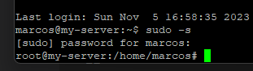
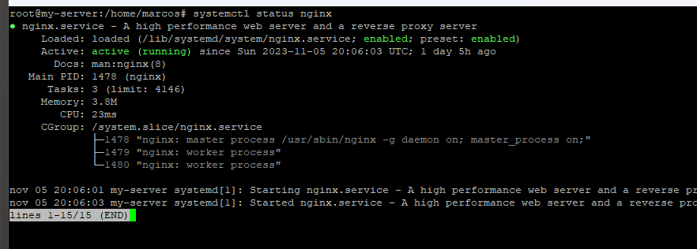
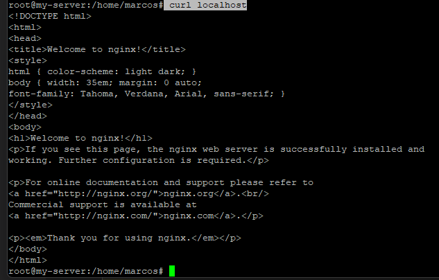

# Instalando e configurando o Nginx
Após instalar e atualizar o sistema, chegou a hora de instalar o Nginx. \
Execute `sudo -s` no terminal para executar todos os próximos comandos como usuário *root*  

então instale o Nginx:
> apt-get -y install nginx

inicie o Nginx:
> systemctl start nginx

verifique se está rodando:
> systemctl status nginx  

`CTRL+C` para sair

Acesse a página padrão do Nginx em um navegador, usando o IP da máquina, ou digite `curl localhost` no terminal:

Agora que o Nginx está funcionando perfeitamente, ative o Nginx para iniciar junto com o servidor:
> systemctl enable nginx

Com isso, seu servidor estará pronto para disponibilizar suas aplicações, APIs e sites.

Próximo: [Páginas estáticas com Nginx](./nginx_pages.md)