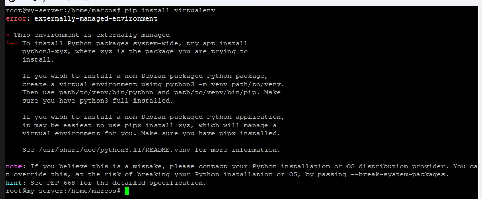
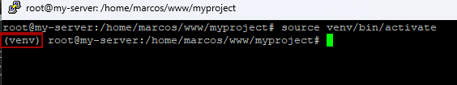
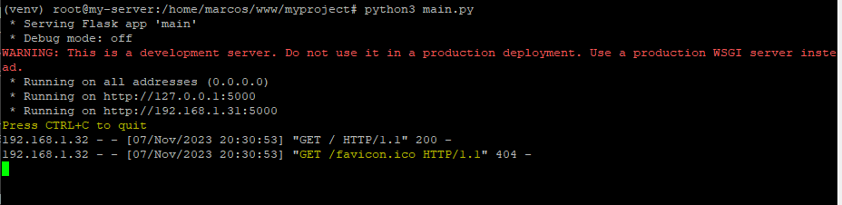
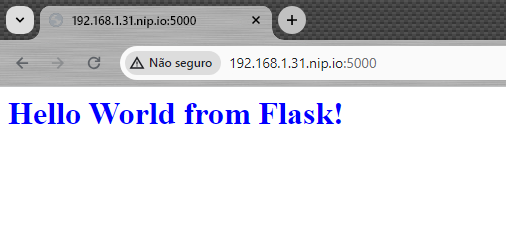
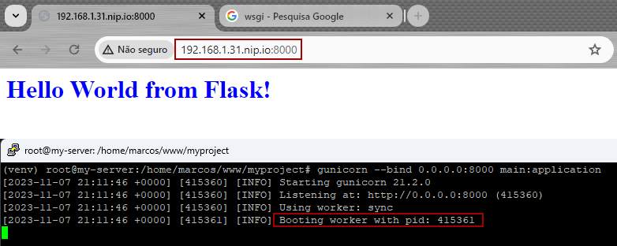

# Proxy reverso

## Criando o Application Server (app)
Um application server permite enviar ao cliente, páginas diferentes, em diferentes situações, ou seja, páginas dinâmicas, como com ReactJS, Django, Flask, etc. Ou simplesmente retornar dados (geralmente JSON) para que um Front End decida o que fazer com ele, sendo assim uma API.

### Instalação do Python3, do PIP e Virtual Enviroment
> apt install python3 python3-pip

Diferente do que é ensinado para o CentOS, caso tente instalar o módulo **virtualenv** no Ubuntu com o comando ``pip install virtualenv``
ocorrerá o seguinte erro:

 
Módulos globais devem ser instalados pelo gerenciador de pacotes do Ubuntu (apt) e não do Python (pip). O pip instalará apenas módulos em ambientes virtuais (*virtual enviroment* ou simplesmente **venv**).
> apt install python3-virtualenv

Ainda na pasta 'www', crie uma pasta chamada 'myproject' e acesse ela:
> mkdir myproject  \
> cd myproject

Nela será criado um ambiente virtual python, que por convenção terá o nome de venv:
> python3 -m venv venv

    python3 executará um módulo chamado venv que recebe um parametro, a pasta onde será criado o ambiente virtual.

Ative o ambiente virtual:
> source venv/bin/activate

Perceba que agora há um prefixo (venv) em seu terminal, indicando que há um ambiente virtual ativo.



### Instalação dos módulos gunicorn e flask
#### Criando o primeiro application server (app)
Com o venv ativado, podemos instalar módulos python sem problemas.
> pip install gunicorn flask

Após a instalação, crie um script python que será responsável pelo nosso serviço:
> nano main.py

Cole o código a seguir:

```Python
from flask import Flask
application = Flask(__name__)

@application.route("/")
def hello():
    return "<h1 style='color:blue'>Hello World from Flask!</h1>"

if __name__ == "__main__":
    application.run(host='0.0.0.0')
```
`CTRL+X` para sair, `Y` para salvar e `ENTER` para confirmar.

EXPLICANDO O CÓDIGO:
```Python
from flask import Flask #importação básica do python, importa o módulo flask a class Flask
application = Flask(__name__) # inicializa um objeto da class Flask. Este é o application server

@application.route("/") # define uma rota '/'
def hello(): # executa a função sempre que acessar esta rota
    return "<h1 style='color:blue'>Hello World from Flask!</h1>" # retorna uma string html

if __name__ == "__main__": # se este script for o principal, roda o app
    application.run(host='0.0.0.0')
```

Execute o script:
> python3 main.py



Acesse a url informada através de um web browser: http://localhost:5000 ou http://192.168.1.31.nip.io:5000/ dependendo se usa um SO desktop em uma maquina virtual ou um SO server.


Para encerrar a aplicação pressione `CTRL+D`

#### Utilizando o Gunicorn no app
O Gunicorn é um WSGI - Web Server Gateway Interface (Interface de Porta de Entrada do Servidor Web)

Rode a mesma aplicação, com o gunicorn com o comando:
> gunicorn --bind 0.0.0.0:8000 main:application
    
    --bind para definir o IP e a porta, também é possível usar um arquivo socket
    main:application 'main' é o nome do arquivo e 'application' é o nome da variável, dentro deste arquivo, que guarda o application server (application = Flask())

Perceba que agora usamos a porta 8000 e também inicia um '*worker*' com um pid (id do processo) distinto do guicorn (415360 e 415361)



Por fim, pare o Gunicorn (`CTRL+C`) e desative o venv:
> deactivate

Próximo: [Application Server no Nginx](./nginx_services.md)