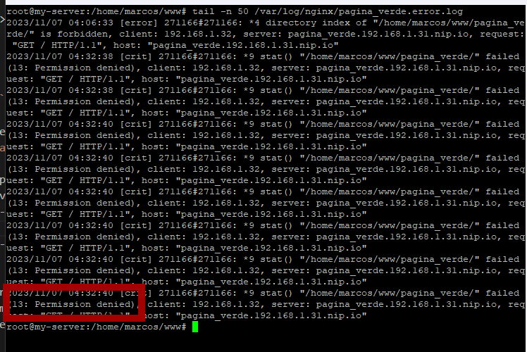

# Proxy reverso
## Desviando o acesso para páginas estáticas
> Note que meu usuário é '**marcos**' e minha pasta é '**/home/marcos**', portanto substitua por seu nome de usuário  \
> Os comandos devem ser executados como root, digite `sudo -s` no terminal para acessar o usuário root

### Preparando o host
- Caso esteja usando uma **máquina virtual**, edite o arquivo de host para apontar os domínios usados no exemplo para seu próprio IP:
    > nano /etc/hosts

    
    `CTRL+X` para sair, `Y` para salvar e `ENTER` para confirmar.

    Neste momento, se acessar *pagina_verde* ou *pagina_azul* no navegador da máquina virtal, deverá aparecer a página padrão do Nginx:
    
- Caso esteja usando um servidor dedicado com um sistema de servidor, sem navegador (meu caso), não adiantará editar o arquivo de host, já que o acesso será através de outra máquina. Neste caso use o serviço chamado [nip.io](nip.io)

    http://pagina_verde.192.168.1.31.nip.io/  
    A URL é composta por um subdomínio de palavras e o IP local do seu servidor, seguido por *.nip.io*  \
    (não esqueça de apagar o **S** de http**s**, pois nosso server não tem certificado de segurança)
    

### Criando o redirecionamento:
Acesse o diretório padrão do Nginx com as rotas disponíveis.
> cd /etc/nginx/sites-available

Crie um arquivo, de preferência que tenha um nome que lembre a quê ele se refere, usaremos *pagina_verde*.  
> nano pagina_verde

copie o código abaixo e cole nele (clique com o botão direto do mouse sobre o terminal).
```
server {
        listen 80;
        listen [::]:80;

        server_name pagina_verde.192.168.1.31.nip.io;

        root /home/marcos/www/pagina_verde;
        index index.html;

        #logs
        access_log /var/log/nginx/pagina_verde.access.log;
        error_log /var/log/nginx/pagina_verde.error.log;

        location / {
                try_files $uri $uri/ =404;
        }
}
```
`CTRL+X` para sair, `Y` para salvar e `ENTER` para confirmar.

Feito isso, vamos para o diretório de sites ativados:
> cd /etc/nginx/sites-enabled/

E crie um link simbólico para o arquivo anterior:
> ln -s /etc/nginx/sites-available/pagina_verde pagina_verde

O comando `ls` mostra o conteúdo da pasta atual.  \
O comando `ll` mostra, **em detalhes**, o conteúdo da pasta atual.


EXPLICANDO O ARQUIVO *pagina_verde*
```
server {
    // este bloco indica que é um serviço web
    // que escutará a porta 80 em ipv4 e ipv6
        listen 80;
        listen [::]:80;

        server_name pagina_verde.192.168.1.31.nip.io;
        // o nome do serviço é 'pagina_verde.192.168.1.31.nip.io'
        // este deve ser o mesmo nome que estará na barra de endereço do navegador (URL)

        root /home/marcos/www/pagina_verde;
        // root é local onde estão os arquivos deste serviço
        // index indica qual arquivo será procurado como página inicial
        index index.html;

        #logs
        // aqui são indicados os logs de acesso e erro deste serviço
        access_log /var/log/nginx/pagina_verde.access.log;
        error_log /var/log/nginx/pagina_verde.error.log;

        location / {
                try_files $uri $uri/ =404;
        }
}
```
Execute o comando para recarregar as novas configurações do Nginx:
> service nginx restart

### Criando o conteúdo
Após o Nginx ter aplicado as novas configurações, ao acessar o endereço da nossa página verde, não aparecerá mais a página padrão do Nginx, mas sim uma página de '404 não encontrado', pois indicamos a pasta e o arquivo, mas ainda não o criamos.


Para criar a pasta entre com o comando:
> mkdir /home/marcos/www/pagina_verde

Depois acesse a pasta com:
> cd /home/marcos/www/pagina_verde

Por fim, crie o arquivo index.html
> nano index.html

e cole o seguinte conteúdo:
```
<!DOCTYPE html>
<html lang="pt-br">

<head>
    <meta charset="UTF-8">
    <meta name="viewport" content="width=device-width, initial-scale=1.0">
    <title>Pagina Verde</title>
    <style>
        body {
            background-color: #0F0;
        }
    </style>
</head>

<body>
    <h1>Esta página é verde</h1>
</body>

</html>
```
`CTRL+X` para sair, `Y` para salvar e `ENTER` para confirmar.

Agora deve aparecer a página verde como a seguir.


Caso a página ainda não apareça, veja o log do Nginx e do serviço da pagina_verde:
> tail -n 10 /var/log/nginx/error.log

> tail -n 10 /var/log/nginx/pagina_verde.error.log



Caso o log indique um erro de permissão, execute o comando: 
> chmod 777 /home/marcos/

Este comando concede acesso de leitura, escrita e execução a todos os usuário do sistema para a pasta '/home/marcos/'
