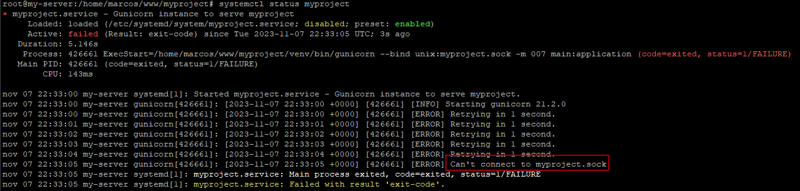
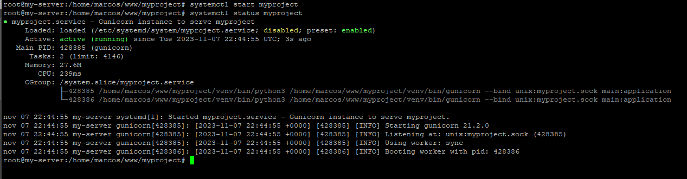
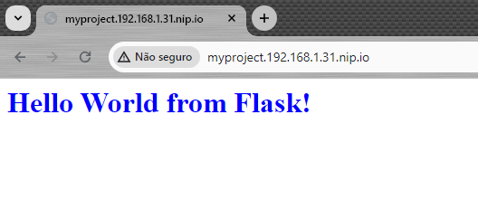

# Proxy reverso
## Disponibilizando serviços no Nginx (APP / API)
> Note que meu usuário é '**marcos**', portanto substitua por seu nome de usuário  \
> Os comandos devem ser executados como root, digite `sudo -s` no terminal para acessar o usuário root

### Configurando o serviço
Crie um arquivo de serviço, este arquivo trará as configurações que o sistema precisa para rodar uma aplicação. O arquivo deve estar em '/etc/systemd/system/'
> nano /etc/systemd/system/myproject.service

E cole o conteúdo abaixo

```
[Unit]
Description=Gunicorn instance to serve myproject
After=network.target

[Service]
User=marcos
Group=marcos
WorkingDirectory=/home/marcos/www/myproject
Environment="PATH=/home/marcos/www/myproject/venv/bin"
ExecStart=/home/marcos/www/myproject/venv/bin/gunicorn --bind unix:myproject.sock -m 007 main:application

[Install]
WantedBy=multi-user.target
```
Salve.

EXPLICANDO O CÓDIGO:

```
[Unit]
// Descrição do serviço
Description=Gunicorn instance to serve myproject
// indica que deve iniciar após efetuar a conexão de rede
After=network.target

[Service]
User=marcos
Group=marcos
// Diretório do serviço
WorkingDirectory=/home/marcos/www/myproject
// Diretório do venv
Environment="PATH=/home/marcos/www/myproject/venv/bin"
// Comando que será executado
ExecStart=/home/marcos/www/myproject/venv/bin/gunicorn --bind unix:myproject.sock -m 007 main:application

[Install]
// indica que será executado para todos os usuários
WantedBy=multi-user.target
```

Perceba que o comando que será executado  \
`gunicorn --bind unix:myproject.sock main:application`  \
é parecido com o anterior que rodamos quando criamos e testamos o app  \
`gunicorn --bind 0.0.0.0:8000 main:application`  \
a diferença é que usaremos um arquivo '*.sock*' invés de um IP e porta, este arquivo será lido pelo Nginx.

Inicie o serviço criado e veja o status do mesmo (não precisamos informar a extensão do arquivo '*.service*'):
> systemctl start myproject

aguarde uns 10 segundos
> systemctl status myproject

Caso ocorra este erro de conexão com o socket:


Garanta que a pasta tem permisão de leitura, escrita e execução:
> chmod 777 /home/marcos/www/myproject/

Inicie novamente o serviço e veja o status:
> systemctl start myproject  \
> systemctl status myproject


Active: active (running) - em verde  \
Loaded: loaded (/etc/systemd/system/myproject.service; disabled; - em amarelo  \
O status *active (running)* indica que o serviço está ativo e rodando, porém o status '*loaded ... disabled;*' indica que está desabilitado para iniciar com o sistema. Rode o comando para habilitar:
> systemctl enable myproject

Veja o status de novo com `systemctl status myproject`, desta vez estará verde o status loaded.

### Configurando o serviço no Nginx
Aqui será realizado um procedimento igual ao ensinado em [Páginas estáticas com Nginx](./nginx_pages.md), portanto não terá tantos detalhes, a diferença é que ao invés de chamar o serviço de *pagina_verde*, chamaremos de *myproject* e ao invés de apontar para um arquivo 'index.html' com location **try_files**, usaremos o arquivo 'myproject.sock' com location **proxy_pass** como mencionado acima.

Acesse o diretório padrão do Nginx com as rotas disponíveis.
> cd /etc/nginx/sites-available  \
> nano myproject

copie o código abaixo e cole nele (clique com o botão direto do mouse sobre o terminal).
```
server {
        listen 80;
        listen [::]:80;

        server_name myproject.192.168.1.31.nip.io;

        #logs
        access_log /var/log/nginx/myproject.access.log;
        error_log /var/log/nginx/myproject.error.log;

        location / {
            proxy_pass http://unix:/home/marcos/www/myproject/myproject.sock;
        }
}
```
`CTRL+X` para sair, `Y` para salvar e `ENTER` para confirmar.
> cd /etc/nginx/sites-enabled/  \
> ln -s /etc/nginx/sites-available/myproject myproject  \
> service nginx restart

Acesse: http://myproject.192.168.1.31.nip.io/
